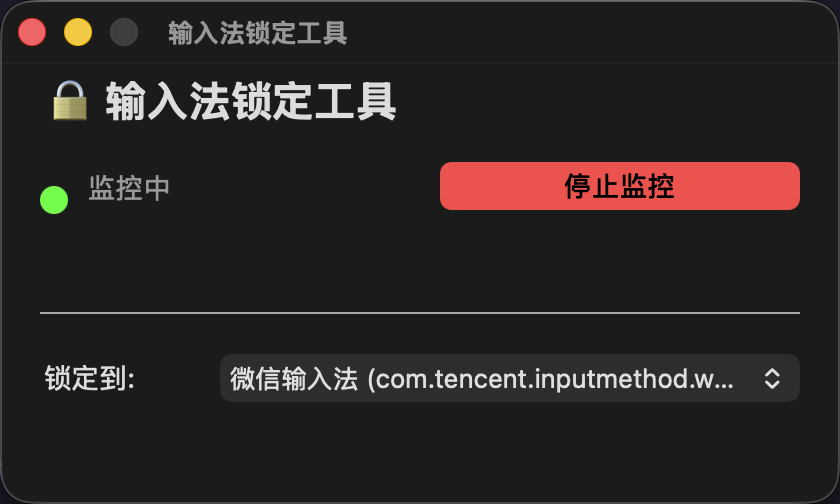

# macOS 输入法锁定工具

一款专为 macOS 设计的输入法管理工具，可防止系统自动切换到 ABC 输入法，保持你选择的输入法（如微信输入法、搜狗输入法等）始终激活。

## 🎯 功能特性

- **实时监控**: 持续监控输入法状态变化（0.3 秒检测间隔）
- **自动拦截**: 检测到切换到 ABC 时立即切换回目标输入法
- **简洁界面**: 提供直观的 Cocoa 图形界面
- **菜单栏图标**: 在菜单栏显示 🔒 状态图标
- **配置保存**: 自动保存你的输入法偏好
- **开机自启**: 可添加到登录项实现自动启动

## 使用展示



## 📦 项目结构

```
InputSourceLock/
├── InputSourceLock/              # 命令行版本
│   └── main.swift
├── InputSourceLockSimpleGUI/     # 图形界面版本（简化版）
│   └── main.swift
├── Assets/                       # 应用资源（图标等）
│   └── AppIcon.iconset/
├── Package.swift                 # Swift Package 配置
├── build.sh                      # 编译脚本
└── README.md                     # 项目说明
```

## 🚀 快速开始

### 方法一：使用编译脚本（推荐）

```bash
# 1. 进入项目目录
cd InputSourceLock

# 2. 运行编译脚本
bash build.sh

# 3. 编译完成后，运行 GUI 版本
open InputSourceLock.app
```

### 方法二：手动编译命令行版本

```bash
# 1. 进入项目目录
cd InputSourceLock

# 2. 编译
swift build -c release

# 3. 查看可用输入法
.build/release/InputSourceLock

# 4. 锁定到指定输入法
.build/release/InputSourceLock com.tencent.inputmethod.WeChatIM.Pinyin
```

### 方法三：手动编译图形界面版本

```bash
# 1. 编译
cd InputSourceLockSimpleGUI
swiftc -o ../InputSourceLock.app/Contents/MacOS/InputSourceLock \
    -framework Cocoa -framework Carbon \
    main.swift

# 2. 运行
open ../InputSourceLock.app
```

## 📋 使用方法（图形界面）

1. **启动应用**后，会看到简洁的主界面
2. **从下拉菜单选择**你要锁定的输入法（如"微信输入法"）
3. **点击绿色的"开始监控"按钮**
   - 按钮变为红色"停止监控"
   - 状态指示灯变为绿色
   - 菜单栏显示 🔒 图标
4. 程序会自动阻止切换到 ABC 输入法
5. 点击红色"停止监控"即可退出

### 菜单栏操作

- 点击菜单栏的 🔒 图标
- 选择"显示窗口"返回主界面
- 选择"退出"完全退出程序

## 🔍 常见输入法 ID

| 输入法名称 | 输入法 ID |
|-----------|----------|
| 微信输入法 | `com.tencent.inputmethod.WeChatIM.Pinyin` |
| 搜狗输入法 | `com.sogou.inputmethod.SogouPinyin` |
| 百度输入法 | `com.baidu.inputmethod.BaiduIM.Pinyin` |
| QQ 输入法 | `com.tencent.inputmethod.QQPinyin` |
| 拼音 - 简体 | `com.apple.inputmethod.SCIM.ITABC` |
| 五笔字型 | `com.apple.inputmethod.SCIM.WBIM` |
| 英文 ABC | `com.apple.keylayout.ABC` |

> ⚠️ **提示**: 实际 ID 可能因版本不同而有差异，请在应用的下拉列表中选择即可，无需手动输入 ID。

## ⚙️ 开机自启设置

### 方法一：使用自动设置脚本（最简单）

项目提供了自动化脚本，一键配置开机启动：

```bash
# 1. 进入项目目录
cd InputSourceLock

# 2. 运行自动设置脚本
./setup-autostart.sh

# 3. 根据提示操作
# 脚本会自动完成以下工作：
# - 检查并编译应用（如果尚未编译）
# - 将 InputSourceLock.app 复制到应用程序文件夹
# - 添加到系统登录项
# - 验证配置是否成功
```

**优点**：
- ✅ 一键完成所有配置
- ✅ 自动处理编译和安装
- ✅ 智能检测配置状态
- ✅ 提供清晰的反馈信息

### 方法二：通过系统设置（手动）

1. 打开 **系统设置** → **通用** → **登录项**
2. 点击 "+" 添加应用程序
3. 选择 `InputSourceLock.app`
4. 完成！下次开机时会自动启动

### 方法三：创建 LaunchAgent（高级用户）

```bash
# 创建启动代理配置文件
cat > ~/Library/LaunchAgents/com.wukong.InputSourceLock.plist << 'EOF'
<?xml version="1.0" encoding="UTF-8"?>
<!DOCTYPE plist PUBLIC "-//Apple//DTD PLIST 1.0//EN" "http://www.apple.com/DTDs/PropertyList-1.0.dtd">
<plist version="1.0">
<dict>
    <key>Label</key>
    <string>com.wukong.InputSourceLock</string>
    <key>ProgramArguments</key>
    <array>
        <string>/path/to/InputSourceLock.app/Contents/MacOS/InputSourceLock</string>
    </array>
    <key>RunAtLoad</key>
    <true/>
</dict>
</plist>
EOF

# 加载启动代理
launchctl load ~/Library/LaunchAgents/com.wukong.InputSourceLock.plist
```

## 🛠️ 技术实现

本应用使用 macOS Carbon 框架的 Text Input Source (TIS) API:

- `TISCopyCurrentKeyboardInputSource()` - 获取当前输入法
- `TISCreateInputSourceList()` - 获取所有可用输入法
- `TISSelectInputSource()` - 切换到指定输入法
- `TISGetInputSourceProperty()` - 获取输入法属性

监控逻辑在主线程 RunLoop 中运行，确保 HIToolbox API 的正确调用。

## ❓ 常见问题

### Q: 为什么有时会看到切换到 ABC？
A: 某些应用（特别是系统级应用）可能会强制切换输入法。程序会在 0.3 秒内检测并切换回来。

### Q: 会影响其他输入法的正常使用吗？
A: 不会。程序只阻止切换到 ABC 输入法，你可以在目标输入法内部正常切换中英文模式。

### Q: 如何完全退出程序？
A: 点击菜单栏 🔒 图标 → 选择"退出"。

### Q: 找不到我的输入法怎么办？
A: 应用启动时会自动加载所有可用输入法，在下拉菜单中选择即可。

### Q: 可以锁定到其他非 ABC 输入法吗？
A: 可以！选择任何你想要的输入法作为目标即可，不仅限于阻止 ABC。

## 📝 开发环境要求

- macOS 13.0 或更高版本
- Xcode 15.0+（可选，用于 GUI 开发）
- Swift 5.9+

## 📄 许可证

MIT License

## 👨‍💻 作者

忘忧 - Java 江湖侠客岛

---

**💡 如果这个工具对你有帮助，欢迎 Star ⭐ 分享给更多需要的朋友！**
